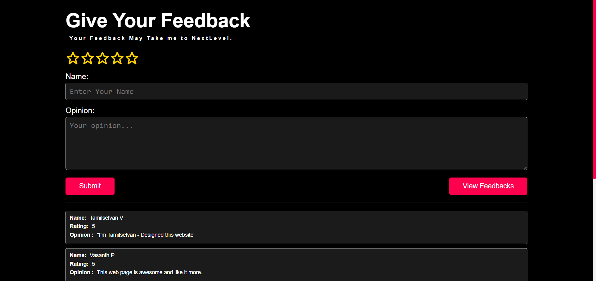

# Rating-Feedback Website



# Rating-Feedback Website(Mobile View)


**Collect User Feedback and Reviews with an Interactive Rating System**

---

## Table of Contents

- [About](#about)
- [Features](#features)
- [Demo](#demo)
- [Installation](#installation)
- [Usage](#usage)
- [Feedback](#feedback)
- [Contributing](#contributing)
- [Contact Me](#contact-me)
- [License](#license)

---

## About

Welcome to the Rating-Feedback Website! This web application provides a platform for users to share their opinions and experiences. By utilizing an engaging star rating system, users can provide valuable feedback to help improve the website.

---

## Features

- 🌟 Interactive Star Rating: Let users express their experiences through star ratings.
- 🖋️ User Reviews: Collect users' opinions and feedback on their experiences.
- 📊 Real-time Display: Submitted reviews are instantly displayed for others to see.
- 📱 Responsive Design: Enjoy a seamless experience on various devices and screen sizes.

---

## Demo

👉 **Check out the live demo: [Rating-Feedback Website Demo](https://tamilselvan6.github.io/profolio/)**

---

## Installation

1. **Clone the Repository:** Run `git clone https://github.com/your-username/rating-feedback-website.git`
2. **Navigate to the Folder:** Go to the project directory using `cd rating-feedback-website`
3. **Open in Browser:** Launch `index.html` in your favorite web browser.

---

## Usage

1. **Visit the Website:** Open the website using your web browser.
2. **Rate Your Experience:** Express your experience using the interactive star ratings.
3. **Share Your Opinion:** Provide your name and opinion in the designated fields.
4. **Submit Your Feedback:** Click the "Submit" button to contribute your feedback.
5. **Explore User Reviews:** View collected feedback by clicking "View Feedbacks."

---

## Feedback

Your thoughts matter! If you encounter any issues or have ideas for improvements, please [open an issue](https://github.com/your-username/rating-feedback-website/issues).

---
## Contact Me

If you have any questions, suggestions, or feedback, feel free to reach out to me:

- **Email:** 21cse058tamilselvan@gmail.com
- **LinkedIn:** [Your LinkedIn Profile](https://www.linkedin.com/in/vtamilselvanbe)

---

## App Script for Sending Notifications

Here's a sample Google Apps Script code snippet that you can use to send notifications when new feedback is submitted:

```javascript
var sheetName = 'Sheet1'; // Replace with your sheet name
var scriptProp = PropertiesService.getScriptProperties();

function intialSetup() {
  var activeSpreadsheet = SpreadsheetApp.getActiveSpreadsheet();
  scriptProp.setProperty('key', activeSpreadsheet.getId());
}

function doPost(e) {
  var lock = LockService.getScriptLock();
  lock.tryLock(10000);

  try {
    var doc = SpreadsheetApp.openById(scriptProp.getProperty('key'));
    var sheet = doc.getSheetByName(sheetName);

    var headers = sheet.getRange(1, 1, 1, sheet.getLastColumn()).getValues()[0];
    var nextRow = sheet.getLastRow() + 1;

    // Modify this part based on your form field names
    var newRow = headers.map(function(header) {
      if (header === 'timestamp') {
        return new Date();
      } else if (header === 'rating') {
        return parseInt(e.parameter[header]); // Convert rating to integer
      } else {
        return e.parameter[header];
      }
    });

    sheet.getRange(nextRow, 1, 1, newRow.length).setValues([newRow]);

    return ContentService
      .createTextOutput(JSON.stringify({ 'result': 'success', 'row': nextRow }))
      .setMimeType(ContentService.MimeType.JSON);
  } catch (e) {
    return ContentService
      .createTextOutput(JSON.stringify({ 'result': 'error', 'error': e }))
      .setMimeType(ContentService.MimeType.JSON);
  } finally {
    lock.releaseLock();
  }
}


```

---

## Contributing

We invite you to contribute to this project and make it even better! Here's how:

1. **Fork the Repository**
2. **Create a New Branch:** `git checkout -b feature-new-feature`
3. **Implement Changes:** Add your enhancements and features.
4. **Commit and Push:** `git commit -m "Add new feature"` and `git push origin feature-new-feature`
5. **Create a Pull Request:** Submit a PR to merge your changes.

---

## License

This project is licensed under the [MIT License](LICENSE).

---
